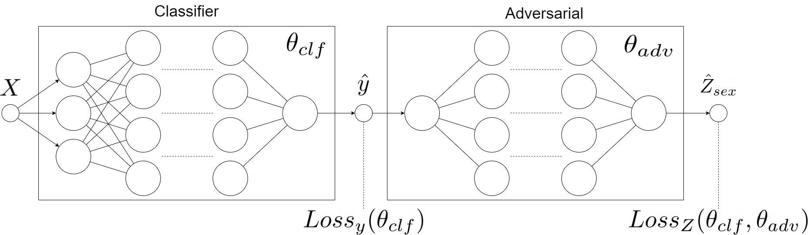

# FairPAN

In this tutorial you will get to know when, why and how to use `FairPAN` and 
you will also learn about how this model works from theoretical side.
`FairPAN`, which stands for `Fair Predictive Adversarial Network`, is a tool 
not only for creating fair predictive adversarial networks,
but also for monitoring the training process and visualizing its outcomes. This
package is really flexible, because the user can not only provide its own neural 
network models, but also create them with our functions.

## How does it work?

### Introduction to Fairness

Consider the idea of the algorithm that has to predict whether giving credit to a person is risky or not. It is learning on real data of giving credits which were biased against females (historical fact). In that case, the model learns this bias, which is not only included in the simple sex variable but also is hidden inside other variables. Fairness enables us to detect such bias and handles a few methods to fight it. To learn more, I recommend the article ['Fairmodels: A Flexible Tool For Bias Detection, Visualization, And Mitigation' by Jakub Wisniewski and Przemysław Biecek]("https://arxiv.org/pdf/2104.00507.pdf").

### Introduction to GANs

Generative Adversarial Networks are two neural networks that learn together. The Generator has to generate new samples that are indistinguishable from original data and the adversarial has to distinguish if the observation is original or generated. The generator is punished whenever the adversarial makes the correct prediction. After such process generator eventually learns how to make indistinguishable predictions and adversaries' accuracy drops up to 50% when a model cannot distinguish the two classes. The idea of GANs
was proposed in [Generative Adversarial Nets, Ian Goodfellow](https://arxiv.org/pdf/1406.2661.pdf).

### FairPAN

FairPANs are the solution to bring fairness into neural networks. We mimic the GANs by subsetting generator with classifier (predictor) and adversarial has to predict the sensitive value (such as sex, race, etc) from the output of the predictor. This process eventually leads the classifier to make predictions with indistinguishable sensitive values. The idea comes from blogs: [Towards fairness in ML with adversarial networks, Stijn Tonk](https://godatadriven.com/blog/towards-fairness-in-ml-with-adversarial-networks/) and [Fairness in Machine Learning with PyTorch, Henk Griffoen](https://godatadriven.com/blog/fairness-in-machine-learning-with-pytorch/) however, our implementation in R offers slightly different solutions. And the exact idea behind using GANs for Fairness is described in [Achieving Fairness through Adversarial Learning: an Application to Recidivism Prediction, Christina Wadsworth, Francesca Vera, Chris Piech](https://stanford.edu/~cpiech/bio/papers/fairnessAdversary.pdf).


The diagram above represents the architecture of our model and is strongly inspired by aformentioned blogs

### Custom Loss Function

The crucial part of this model is the metric we use to engage the two models into a zero-sum game. This is captured by the following objective function: 


{width=50%}

So, it learns to minimize its prediction losses while maximizing that of the adversarial (due to lambda being positive and minimizing a negated loss is the same as maximizing it). The objective during the game is simpler for the adversarial: predict sex based on the income level predictions of the classifier. This is captured in the following objective function:

{width=30%}

The adversarial does not care about the prediction accuracy of the classifier. It is only concerned with minimizing its prediction losses.
Firstly we pretrain classifier and adversarial. Later we begin the proper PAN training with both networks: we train the adversarial, provide its loss to the classifier, and after that, we train the classifier. This method shall lead us to fair predictions of the FairPAN model.

## Why?

Regular mitigation techniques tend to worsen performance of the classifier a lot
by decreasing accuracy for example, whereas FairPAN has no such drawback and
worsening of the performance is really small. Moreover, our package is very 
flexible because it enables to provide your own neural networks, but also
to create one with our functions. The outcomes are also created with the usage of
`DALEX` and `fairmodels`, so one can use their methods and visualizations. 
Additionally the workflow of the package is really simple and clean, because of 
multiple features available for user, such as `preprocess` function.

## Data

The dataset used in our tutorial is called adult. It contains 15 columns with
both numerical and categorical data about citizens of USA. Our target here is
a `salary` column. As sensitive variables we can perceive `sex` and `race`
however we will focus only on `sex`.

```{r import-adult}
library(FairPAN)
adult <- fairmodels::adult
head(adult)
```

# Workflow

## Preprocessing

At the beginning we have to preprocess our dataset so we can train a neural
network on it and divide it into train and test subsets. One can do it on your
own, however we will use built in function called preprocess which will create
16 objects which are needed for other features.

To use this function we have to provide a dataset with categorical columns 
provided as factors. Then we define that `salary` is our target and `sex` is a
sensitive variable with privileged level `Male` and discriminated `Female`. 
As we noticed before, `race` could also be considered as a sensitive variable
so we want to remove it from our learning dataset too. In the end we sample a
small part of the dataset for our process to save our time in this example and
define proportions of train, test and validation subsets. We also set seed for
reproduction.

Inside, the function encodes the categorical columns as integers based on their
factor levels. After that all variables are rescaled to ensure better learning
process. Moreover to ensure that adversarial model works properly, we also 
balance a dataset to have the same number of privileged and discriminated
records.

```{r preprocess}
data <- preprocess( data = adult,               # dataset 
                    target_name = "salary",     # name of target column
                    sensitive_name = "sex",     # name of sensitive column
                    privileged = "Male",        # level of privileged class
                    discriminated = "Female",   # level of discriminated class
                    drop_also = c("race"),      # columns to drop (perhaps 
                                                # other sensitive variable)
                    sample = 0.02,              # sample size from dataset
                    train_size = 0.6,           # size of train set
                    test_size = 0.4,            # size of test set
                    validation_size = 0,        # size of validation set
                    seed = 7                    # seed for reproduction.
)

head(data$train_x,2)
head(data$train_y,2)
head(data$sensitive_train,2)
head(data$test_x,2)
head(data$test_y,2)
head(data$sensitive_test,2)
head(data$data_scaled_test,2)
head(data$data_test,2)
head(data$protected_test,2)

```

We've decided to show the most important objects created by preprocess above.

Our next step is setting a computational device `dev`, which might be GPU with 
CUDA or cpu if we don't have CUDA installed. Even more importantly we create a 
dataset_loader object which stores data as tensor for our neural network in 4
objects. First two of them are torch `datasets` for storing all the tensors 
and the other two are torch `dataloaders` which store tensors in batches
described by `batch_size`.

```{r dataset_loader}
dev <- if (torch::cuda_is_available()) torch_device("cuda:0") else "cpu"

dsl <- dataset_loader(train_x = data$train_x,
                      train_y = data$train_y,
                      test_x = data$test_x,
                      test_y = data$test_y,
                      batch_size = 5,
                      dev = dev
)
print(dsl$train_dl$.iter()$.next())
```

In the end of preprocessing you can see how the single batch of train data
loader looks like.

## Model creation and pretrain

Finally we are ready to create and pretrain both adversarial and classifier
models. `FairPAN` provides multiple options in this case, because one can not 
only create and pretrain both models with our interface, but also provide their
own neural network models (`clf_model` and `adv_model`). The classifier model 
can be also pretrained, but then `clf_optimizer` from that training must be 
provided and `trained` changed to TRUE.

In our first example we will focus on pretraining both models created by
the `pretrain` function. 
To do that you don't have to provide first four variables, because they are set 
like that on default. One has to provide `data`
in next four variables and then, the other two describe inner `dataset_loader` 
for adversarial network. Next block describes the structure of our models. Neural
architecture is provided as a simple vector where, for example, c(32,16,8) describes a network
with 3 layers with 32, 16 and 8 neurons. This layers are connected with 
`nn_linear` and during forward pass, inner layers have `nnf_relu` with 
`nnf_softmax` in the end. User can also define dimension for softmax, however we
advice not to do so, because other approaches are not sufficiently tested. 
In the end one can also provide learning rates and numbers
of epochs for both models.
In the end we have to provide a dataset_loader with device and choose whether
we want to monitor more metrics and print them out.
As a result we will obtain pretrained neural network models (classifier and 
adversarial) and optimizers for those two models.

```{r auto-pretrain}

models <- pretrain(clf_model = NULL,                       # classifier model
                   adv_model = NULL,                       # adversarial model
                   clf_optimizer = NULL,                   # classifiers optimizer
                   trained = FALSE,                        # indicates whether provided classifier is 
                                                           # trained
                   
                   train_x = data$train_x,                 # train predictors
                   train_y = data$train_y,                 # train target
                   sensitive_train = data$sensitive_train, # train sensitives
                   sensitive_test = data$sensitive_test,   # test sensitives
                   
                   batch_size = 5,                         # inner dataset_loader batch size
                   partition = 0.6,                        # partition for inner adversaries 
                                                           # dataset_loader preparation
                   
                   neurons_clf = c(32, 32, 32),            # classifiers neural architecture
                   neurons_adv = c(32, 32, 32),            # adversaries neural architecture
                   dimension_clf = 2,                      # dimension for classifier (always set 2)
                   dimension_adv = 1,                      # dimension for adversarial (always set 1)
                   learning_rate_clf = 0.001,              # learning rate of classifier
                   learning_rate_adv = 0.001,              # learning rate of adversarial
                   n_ep_preclf = 10,                        # number of epochs for classifier pretrain
                   n_ep_preadv = 10,                       # number of epochs for adversarial pretrain
                   
                   dsl = dsl,                              # dataset_loader
                   dev = dev,                              # computational device
                   verbose = TRUE,                         # if TRUE prints metrics
                   monitor = TRUE                          # if TRUE aquires more data ( also to print)
)

```

As we've mentioned before, we can also provide our own pretrained model to the 
`pretrain` function, just like in the example below. Note that in this 
particular case we create the same classifier as in the previous example and
the only difference is that we do it outside the `pretrain` function.
`create_model` and `pretrain_net` are the methods which we also use under the
`pretrain`, but the user is also able to call them and their parameters are
similar to those in the pretrain. `create_model` returns the neural network 
architecture, whereas `pretrain_net` proceeds with its training and returns
losses and optimizer from the learning process.

As you can see, in `pretrain` we provide `clf_model`,`clf_optimizer` and change 
`trained` to TRUE as stated before.

```{r advanced-pretrain}

clf <- create_model(train_x = data$train_x,                # train predictors
                    train_y = data$train_y,                # train target 
                    neurons = c(32,32,32),                 # models neural architecture
                    dimensions = 2                         # dimension for model (always set 2 for 
                                                           # classifier 1 for adversary)
)

opt <- pretrain_net(n_epochs = 10,                          # number of epochs for model pretrain
                    model = clf,                           # neural network model
                    dsl = dsl,                             # dataset_loader
                    model_type = 1,                        # model type (1 means precalssifer)
                    learning_rate = 0.001,                 # learning rate of classifier
                    sensitive_test = data$sensitive_test,  # test sensitives
                    dev = dev,                             # computational device
                    verbose = TRUE,                        # if TRUE prints metrics
                    monitor = TRUE                         # if TRUE aquires more data ( also to print)
)

print(opt$optimizer)

clf_optimizer <- opt$optimizer
    
models <- pretrain(clf_model = clf,                        # classifier model
                   adv_model = NULL,                       # adversarial model
                   clf_optimizer = clf_optimizer,          # classifiers optimizer
                   trained = TRUE,                         # indicates whether provided classifier is 
                                                           # trained
                   train_x = data$train_x,                 # train predictors
                   train_y = data$train_y,                 # train target
                   sensitive_train = data$sensitive_train, # train sensitives
                   sensitive_test = data$sensitive_test,   # test sensitives
                   batch_size = 5,                         # inner dataset_loader batch size
                   partition = 0.6,                        # partition for inner adversaries 
                                                           # dataset_loader preparation
                   neurons_clf = c(32, 32, 32),            # classifiers neural architecture
                   neurons_adv = c(32, 32, 32),            # adversaries neural architecture
                   dimension_clf = 2,                      # dimension for classifier (always set 2)
                   dimension_adv = 1,                      # dimension for adversarial (always set 1)
                   learning_rate_clf = 0.001,              # learning rate of classifier
                   learning_rate_adv = 0.001,              # learning rate of adversarial
                   n_ep_preclf = 5,                        # number of epochs for classifier pretrain
                   n_ep_preadv = 10,                       # number of epochs for adversarial pretrain
                   dsl = dsl,                              # dataset_loader
                   dev = dev,                              # computational device
                   verbose = TRUE,                         # if TRUE prints metrics
                   monitor = TRUE                          # if TRUE aquires more data ( also to print)
)
```

In the end we want to create an explainer for our classification model, but we
will say more about it later.

```{r explain_clf}
exp_clf <- explain_PAN(target = data$test_y,                     # test target
                       model = models$clf_model,                 # classifier model
                       model_name = "Classifier",                # classifiers name
                       data_test = data$data_test,               # original data for test
                       data_scaled_test = data$data_scaled_test, # scaled numeric data for test
                       batch_size = 5,                           # batch_size used in dataset_loader
                       dev = dev,                                # computational device
                       verbose = TRUE                            # if TRUE prints monitor info
)
```

## Fairtrain

Finally we've reached the most important part of this package which is the
`fair_train` function. This function enables us to conduct a fair training
which optimizes Statistical Parity Ratio, thus leading to similar distributions
of privileged and discriminated groups. 
As a short reminder, this method is based on a mutual training of the classifier 
and adversarial, where classifier learns to deceive the adversarial, so in the
end it cannot predict the correct label.
As we use previous models we need to provide them with correct `optimizers`.
Moreover in the loss function equation we see a `lambda` parameter which we also
have to provide. The intuition behind it states that the bigger the `lambda` is
the fairer the training is, but traditional performance, like accuracy worsens
faster. At this point you should be familiar with rest of the parameters,
however `monitor` here collects much more training data (STP ratio, adversary 
accuracy, adversary loss and classifier accuracy) which can be used to monitor
the training process. On the other hand calculating this metrics takes lots of 
time so turning `monitor` off is good when you're sure that your model works 
properly. This function returns NULL if `monitor` is off and aforementioned 
metrics if it is on.

```{r fairtrain}
monitor <- fair_train( n_ep_pan = 17,                           # number of epochs for pan training
                       dsl = dsl,                               # dataset_loader
                       
                       clf_model = models$clf_model,            # classifier model
                       adv_model = models$adv_model,            # adv model
                       clf_optimizer = models$clf_optimizer,    # classifiers optimizer
                       adv_optimizer = models$adv_optimizer,    # adversaries optimizer
                       
                       dev = dev,                               # computational device
                       sensitive_train = data$sensitive_train,  # train sensitives
                       sensitive_test = data$sensitive_test,    # test sensitives
                       
                       batch_size = 5,                          # inner dataset_loader batch size
                       learning_rate_adv = 0.001,               # learning rate of adversarial
                       learning_rate_clf = 0.001,               # learning rate of classifier
                       lambda = 130,                            # train controlling parameter (the 
                                                                # bigger the better STPR results)
                       
                       verbose = TRUE,                         # if TRUE prints metrics
                       monitor = TRUE                           # if TRUE training collects 4 metrics 
                                                                # throughout the epochs
)
monitor
```

## Metrics and Visualizations

After the training process we'd like to visualize the final outcome and the
monitor of metrics throughout learning. To achieve that we have to use `monitor`
in `fair_train` and apply `plot_monitor` function to it. This function is
especially convenient in the process of parameters tuning and model adjustments,
because one can easily check if the model learns properly.

```{r plot_monitor}
plot_monitor(STP = monitor$STP,                                  # monitor for STP
             adversary_acc = monitor$adversary_acc,              # monitor for adversaries accuracy
             adversary_losses = monitor$adversary_losses,        # monitor for adversaries loss
             classifier_acc = monitor$classifier_acc)            # monitor for classifiers accuracy
```

As fairness is closely connected with XAI, we also propose an option to create an
explainer for our neural network models with `explain_PAN` which is 
`DALEX::explain` function with proper adjustments for neural network models.

```{r explain_PAN}
exp_PAN <- explain_PAN(y = data$test_y,                          # test target
                       model = models$clf_model,                 # classifier model
                       label = "PAN",                            # classifiers name
                       data = data$data_test,                    # original data for test
                       data_scaled = data$data_scaled_test,      # scaled numeric data for test
                       batch_size = 5,                           # batch_size used in dataset_loader
                       dev = dev,                                # computational device
                       verbose = TRUE                            # if TRUE prints additional info
)
```

All functions that work on DALEX explainer object also applies to our 
`explain_PAN`, but probably two most interesting ones are `model_performance`
and `fairmodels::fairness_check`.

The first one proves useful when we want to see the performance of the model.
We'd like to show you this functionality by comparing performance of PAN and
ordinary classification model. As we can see below it is true that performance
of PAN slightly diminished (but it's only 1.2% on accuracy!), but the next plot
will show us why it is okay for us.

```{r model_preformance}
DALEX::model_performance(exp_PAN)
DALEX::model_performance(exp_clf)
```

Finally, with `fairmodels::fairness_check` used on explainers (`exp_PAN`,
`exp_clf`) we can compare fairness metrics for both models. We can use this 
function on a single or many explainers, but we have to provide them after comma
one by one and ensure that they have different labels. After creating fairness
object (`fobject`) we can plot it with regular `plot` function.


```{r fairness_check}
fobject <- fairmodels::fairness_check(exp_PAN,exp_clf,        # explainers given one by one
                            protected = data$protected_test,  # protected column
                            privileged = "Male",              # privileged class from protected
                            verbose = TRUE)                   # if TRUE prints additional info
plot(fobject)
```

As we can see, Statistical Parity ratio dramatically increased and the model is
almost fair according to this metric. On the other hand we see worsening of 
other metrics, like Equal Opportunity ratio, however it can be easily explained.
During the fair_train process we make more TP (True Positives) and FP (False
Positives) which directly changes the value of Equal opportunity ratio, so this
sacrifice is unavoidable.
